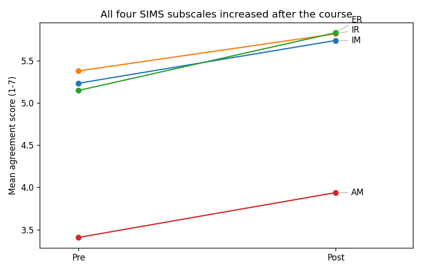

# SIMS Learning-Motivation Survey: One-Page Report

## Background

We analyzed a Situational Motivation Scale (SIMS) survey collected before
(pre-test, round 3) and after (post-test, round 4) a college course. The clean
files use actual 1-7 agreement scores converted from the Excel option-number
sheet with `actual_score = 8 - option_number`.

After cleaning, 43 students completed the pre-test and 44 the
post-test; **41 students completed both** and form the paired sample
used for the t-tests. Survey scores were also merged with a grade report
(44 students matched on student id).

## Reliability (Cronbach's alpha)

| Subscale | Pre alpha | Post alpha |
|---|---|---|
| IM | 0.93 | 0.95 |
| IR | 0.90 | 0.95 |
| ER | **0.36** | 0.92 |
| AM | 0.86 | 0.87 |

IM, IR, and AM are reliable in both waves. **Caveat: the ER pre-test alpha is
only 0.36, far below the 0.7 threshold.** This traces
to item 11, an ER item that was reworded between pre and post, so the pre vs post
ER comparison should be read with the most caution.

## Main results (paired t-test, n=41, df=40)

| Subscale | Pre M(SD) | Post M(SD) | dM | t(40) | p | Cohen's dz |
|---|---|---|---|---|---|---|
| IM | 5.23 (1.04) | 5.74 (0.99) | +0.51 | 3.52 | 0.0011 | 0.55 |
| IR | 5.38 (0.98) | 5.82 (1.00) | +0.44 | 3.42 | 0.0015 | 0.53 |
| ER | 5.15 (0.70) | 5.83 (0.95) | +0.68 | 4.63 | 0.0000 | 0.72 |
| AM | 3.41 (1.07) | 3.94 (1.43) | +0.53 | 3.24 | 0.0024 | 0.51 |

All four subscales increased significantly with medium effect sizes (|dz| about
0.5 to 0.7). Reading direction matters: IM and IR rising are positive signs;
ER rising means more external regulation; **AM rising means more amotivation,
which is bad news**.

Post-test intrinsic motivation (IM) vs final grade correlates r = 0.06
(p = 0.678); a weak positive
and non-significant link.
Correlation is not causation either way.

## Hero chart

## Three teaching takeaways / next steps

1. **Motivation moved in mixed-quality directions.** Self-determined motivation
   (IM, IR) rose, but so did external regulation (ER) and amotivation (AM).
2. **Fix the instrument before the next round.** Item 11's rewrite broke ER's
   pre-test reliability; lock the wording so pre vs post is a fair comparison.
3. **Look past the average.** With only n=41, a rising mean can hide
   subgroups moving in opposite directions; pair these numbers with student
   interviews or a subgroup split before drawing strong conclusions.

> Limits: small paired sample (n=41); ER pre-test reliability and the
> item-11 rewrite; correlation is not causation.
