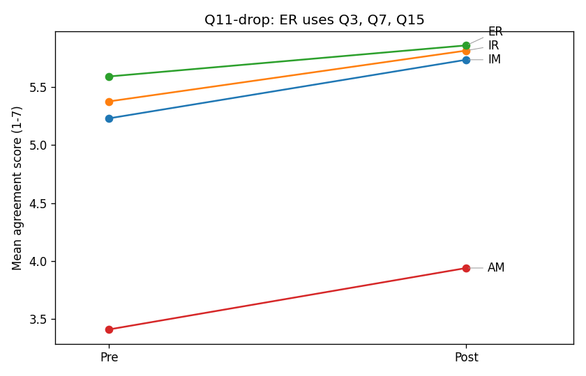

# Q11 Sensitivity Reanalysis Report

## Background

This make-up analysis accepts the Exercise 02 diagnosis: Q11 is a questionnaire-design
problem. To improve reliability and validity for the pre/post t-test, adjusted ER
drops Q11 and uses only Q3, Q7, and Q15. IM, IR, and AM keep the original SIMS
mapping; AM remains Q4, Q8, Q12, and Q16.

The cleaned response files use actual 1-7 agreement scores, converted from the
Excel option-number sheet with `actual_score = 8 - option_number`.

## Adjusted reliability

| Subscale | Items used | Pre alpha | Post alpha |
|---|---|---|---|
| IM | Q1,Q5,Q9,Q13 | 0.93 | 0.95 |
| IR | Q2,Q6,Q10,Q14 | 0.89 | 0.95 |
| ER | Q3,Q7,Q15 | 0.92 | 0.95 |
| AM | Q4,Q8,Q12,Q16 | 0.86 | 0.87 |

After dropping Q11, pre-test ER alpha rises from about 0.36 to 0.92.
That confirms Q11 was the main item undermining pre-test ER reliability.

## Adjusted paired t-test

| Subscale | Pre M(SD) | Post M(SD) | dM | t(40) | p | Cohen's dz |
|---|---|---|---|---|---|---|
| IM | 5.23 (1.04) | 5.74 (0.99) | +0.51 | 3.52 | 0.0011 | 0.55 |
| IR | 5.38 (0.98) | 5.82 (1.00) | +0.44 | 3.42 | 0.0015 | 0.53 |
| ER | 5.59 (1.01) | 5.86 (0.97) | +0.27 | 1.83 | 0.0752 | 0.29 |
| AM | 3.41 (1.07) | 3.94 (1.43) | +0.53 | 3.24 | 0.0024 | 0.51 |

IM, IR, and AM match the original recoded analysis because their item sets did
not change. ER still increases, but p = 0.0752, so the Q11-drop ER change is
not significant at the 0.05 level. The original ER-significant result should
therefore be reported cautiously.

AM still needs careful interpretation: AM increasing means more amotivation,
which is bad news.

## Hero chart

## Grade link

Post-test IM and final grade correlate at r = 0.06 (p = 0.678). This is
not causal evidence either way.
